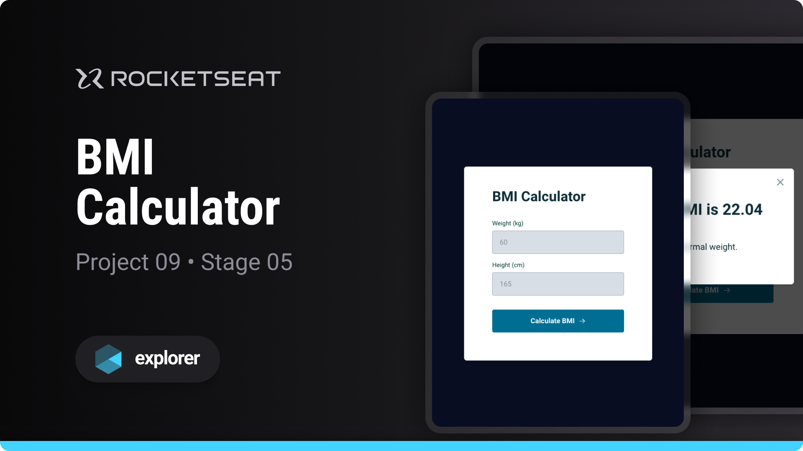

# BMI Calculator

Project developed on Rocketseat's Explorer course

**BMI Calculator is a calculator designed to learn basic JavaScript programming concepts**

## 🔗 Project Links

- 🚀 [**Deploy**](https://emanueltavecia.github.io/bmi-calculator)
- 🎨 [**Figma**](https://www.figma.com/file/atKbLPvU3Ell5kKPtzEXPc/IMC/duplicate)

## 📋 Project information

- Rocketseat Explorer
- Stage 05
- Project 09

## 🧠 Concepts learned

The development of this project aims to learn the following concepts:

- Modal creation and styling
- ES6 Modules
- DOM Manipulation
- Events and Interactivity
- if, else, if else conditions
- Data validation
- functions

## 💻 Technologies

## 📄 License

This project is licensed under the MIT License - see the [LICENSE](./LICENSE) file for more details.
